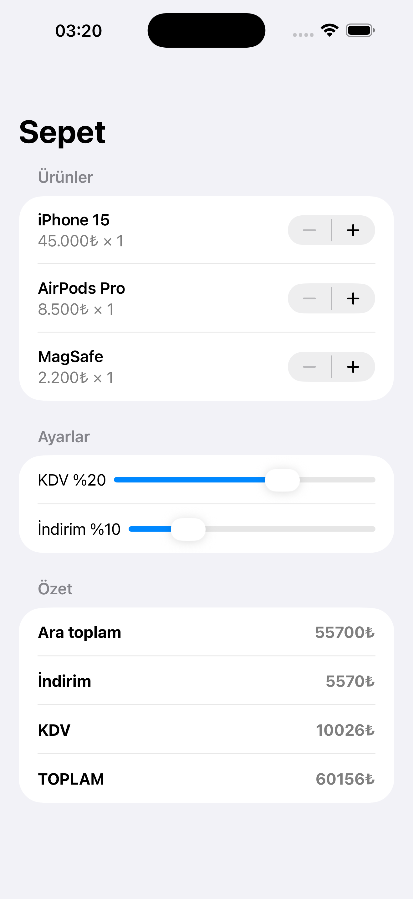

# ReactiveCartApp

A reactive shopping cart app built to explore and practice the Combine framework in Swift.

---

## Screenshot



---

## What I Learned

### Publisher / Subscriber Model
Every `@Published` property automatically becomes a Combine publisher. When a value changes, the pipeline fires automatically — no manual function calls needed.

### CombineLatest3
The `items`, `taxRate`, and `discountPercent` publishers are merged using `Publishers.CombineLatest3`. Whenever any one of them changes, all calculations (subtotal, discount, tax, total) are recomputed inside a single `map` block.

### map → sink Pipeline
The `map` operator computes four `Double` values and returns them as a tuple. `sink` receives the tuple and writes each value to the corresponding `@Published private(set)` output property. The View only reads these values — it cannot write to them.

### Input / Output Separation
- **Input:** `items`, `taxRate`, `discountPercent` — writable by the user and ViewModel.
- **Output:** `subtotal`, `discountAmount`, `taxAmount`, `total` — marked `private(set)`, writable only from within the ViewModel. The View is read-only.

### Structs and Reactive Updates
`CartItem` is defined as a `struct` (value type). When `items[idx].quantity` is updated, Swift creates a memberwise copy and writes the new struct back into the array. `@Published` detects this write and triggers the pipeline. Had `class` been used instead, this automatic triggering would not have occurred.

### AnyCancellable and Memory Management
Since `sink` is used as the subscriber, the returned token is stored in a `Set<AnyCancellable>`. `[weak self]` is used inside the closure to prevent retain cycles. When `assign(to: &$)` is used instead, the token binds itself to the lifetime of the `@Published` property, so no manual `store` call is needed.

---

## Data Flow

```
items / taxRate / discountPercent
          ↓
    CombineLatest3
          ↓
    .map { compute values }
          ↓
    .sink { write to outputs }
          ↓
    SwiftUI View updates automatically
```

---

## Project Structure

```
ReactiveCartApp/
├── CartViewModel.swift   — Combine pipelines and business logic
├── CartItem.swift        — Struct data model
└── ContentView.swift     — SwiftUI View layer
```

---

## Requirements

- iOS 15+
- Swift 5.7+
- Xcode 14+
